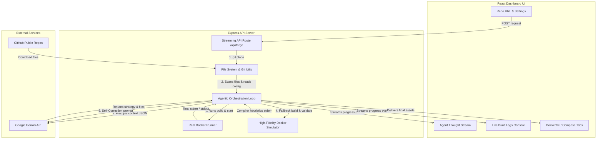

# DockerForge — AI-Powered Dockerfile Generator

DockerForge is an agentic, full-stack AI developer tool designed to automate Dockerfile generation for any GitHub repository. By combining standard directory tree scanners, LLM reasoning, and real/simulated container runtimes, DockerForge achieves closed-loop self-correction of Dockerfiles until they build and run successfully.

---

## 🏗️ High-Level Architecture

DockerForge uses a single-process full-stack architecture. The backend manages repository lifecycles and LLM sessions, while the client dashboard provides a responsive glassmorphic console to inspect the agent's thought streams and terminal outputs.



---

## 🤖 The Agentic Self-Correction Loop

The primary innovation of DockerForge is its **Self-Correction Loop**. Rather than generating a text-only Dockerfile blindly, the agent validates its own output:

1. **Initial Strategy Formulation**: The agent reads the tree hierarchy and configuration files (e.g. `package.json`, `requirements.txt`, `go.mod`, etc.) and determines the framework, dependencies, port exposure, and entry point.
2. **Initial Code Generation**: The agent drafts a Dockerfile using best practices (proper caching layers, multi-stage builds, clean base images).
3. **Execution & Validation Test**: The agent executes `docker build` and `docker run` (either using the local Docker engine or falling back to the high-fidelity simulator).
4. **Heuristics & Stderr Analysis**: If the build fails (e.g., trying to run `npm install` before copying `package.json`, or choosing an incompatible base image), the runner captures the exact compiler output and errors.
5. **LLM Self-Correction Loop (Up to 3 Attempts)**: The agent sends the original failing Dockerfile and the raw stderr outputs back to the LLM. The LLM acts as an expert debugger, explains the exact error, corrects the Dockerfile structure, and restarts the execution cycle.
6. **Health Verification**: Once the build succeeds, the container starts. The runner pings the exposed port. If it fails to respond, it triggers an execution error and corrects it.

---

## ⚡ Setup & Local Running

Ensure you have **Node.js 22.x** and **Git** installed on your host machine.

### 1. Install Dependencies
```bash
npm install
```

### 2. Configure Environment Variables
Create a `.env` file in the root directory:
```env
PORT=5000
GEMINI_API_KEY=your_gemini_api_key_here
```
*(Alternatively, you can paste your API key directly in the Dashboard Settings popup which stores it securely in browser memory).*

### 3. Run in Development Mode
Starts both the Express API server (port 5000) and the Vite + React dev dashboard (port 5173):
```bash
npm run dev
```
Open **[http://localhost:5173](http://localhost:5173)** in your browser!

---

## 📦 Containerized Deployment (Docker)

If Docker is installed on your host, you can easily build and run DockerForge itself.

### 1. Build the Docker Image
```bash
docker build -t dockerforge .
```

### 2. Run the Container
```bash
docker run -d -p 5000:5000 -e GEMINI_API_KEY=your_key_here --name dockerforge-app dockerforge
```
Open **[http://localhost:5000](http://localhost:5000)** in your browser!

---

## 🧠 LLM Provider Choice & Rationale

DockerForge uses the **Google Gemini API** (`gemini-2.5-flash`) as its default AI engine.

### Why Gemini?
* **High-Speed Low-Latency Inference**: Essential for real-time developer workflows where self-correction loops need to complete within seconds.
* **Large Context Window**: DockerForge sends full directory structures and the raw text contents of key configuration files (e.g. locks, readmes, configs) to provide comprehensive context. Gemini easily handles large inputs.
* **Native JSON Mode Compatibility**: By enforcing structured JSON outputs with schema targets, DockerForge parses `dockerfile`, `dockerCompose`, `exposePort`, and `reasoning` reliably and prevents parse errors.
* **DevOps Reasoning Heuristics**: Gemini displays exceptional capabilities in code comprehension and containerization strategies, outperforming other small models.

---

## 🛠️ High-Fidelity Docker Simulator Heuristics

To ensure DockerForge can be verified and demonstrated on developer machines where the Docker daemon is missing (like the current host), it features a built-in **High-Fidelity Docker Simulator**.

The simulator interprets key instructions line-by-line:
1. **`FROM`**: Validates base image. Prints pull status and intermediate digests.
2. **`COPY`**: Tracks which files from the repository clone are transferred to the virtual container filesystem.
3. **`RUN`**: Analyzes scripts (e.g. `npm install`, `pip install`, etc.).
   * *Validation Trigger*: If `RUN npm install` is executed, it checks if `package.json` was copied to the virtual workspace beforehand. If missing, it throws a realistic `npm ERR! enoent ENOENT: no such file or directory, open '/app/package.json'`, triggering the agent's correction flow!
4. **`CMD`**: Validates start command script files.
   * *Validation Trigger*: If `npm start` is executed, it parses the copied `package.json` to verify that a `start` script is defined. If missing, it throws an `npm ERR! missing script: start` error to activate the agent's self-correcting logic.

---

## ⚠️ Known Limitations & Edge Cases

* **Complex Database Dependencies**: If a codebase requires external database connections (e.g. PostgreSQL, Redis) at boot-time without mock states, the real container run validation may fail unless the agent configures container mock states or incorporates service linking in `docker-compose.yml`.
* **Private Git Repositories**: Currently, the git cloner is optimized for public GitHub repositories. Support for private Git links would require providing personal SSH keys or OAuth access tokens in the configuration popup.
* **Large Build Contexts**: When cloning gigantic codebases, scanning might experience higher latency. DockerForge incorporates file filters (`node_modules`, `.git`, `.venv`) to optimize analysis sizes.
